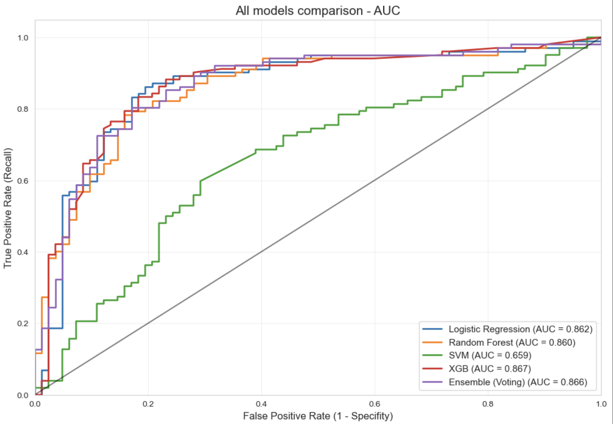
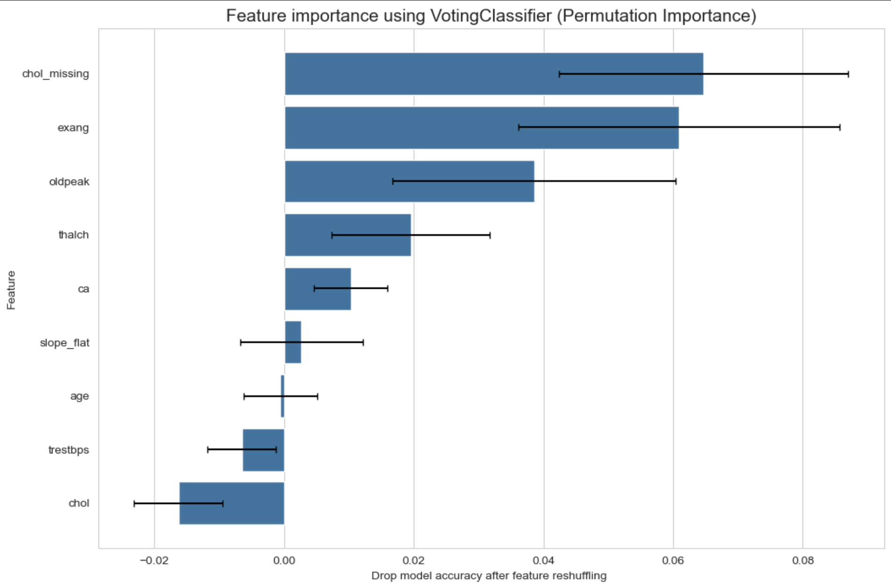

# ISLP book Solutions and Main Project 🐍

This repository contains main project summing my knowledge and my solutions to the labs and exercises from the book **"An Introduction to Statistical Learning with applications in Python" (ISLP)** which served as classical roadmap for learning. This project serves as a comprehensive documentation of my journey through the mathematical and practical foundations of Machine Learning.

### ⚙️ Core Concepts 
I implemented and analyzed the following statistical methods:
* **Regression:** Simple & Multiple Linear Regression, Polynomial Regression.
* **Classification:** Logistic Regression, LDA, QDA, Naive Bayes, K-Nearest Neighbors (KNN).
* **Resampling Methods:** K-Fold Cross-Validation, Bootstrapping.
* **Linear Model Selection:** Subset Selection, Ridge & Lasso Regression (Regularization).
* **Tree-Based Methods:** Decision Trees, Random Forests, Bagging, and Boosting.
* **Unsupervised Learning:** Principal Component Analysis (PCA), K-Means, and Hierarchical Clustering.

### 🛠️ Tech Stack
* **Core Libraries:** * `ISLP`
    * `scikit-learn` (model implementation and evaluation)
    * `statsmodels` (detailed statistical inference, p-values, and R-squared analysis)
    * `pandas` & `numpy` (data manipulation)
    * `matplotlib` & `seaborn` (diagnostic plotting and EDA)

### 📂 Repository Structure
The solutions are organized by chapter. Each directory contains a Jupyter Notebook (`.ipynb`) with commented code and statistical interpretations:
* `/ch03_linear_regression` - Diagnostic plots, multicollinearity analysis (VIF).
* `/ch04_classification` - Comparing classifiers on the `Smarket` and `Default` datasets.
* `/ch06_linear_model_selection` - Implementing Lasso to perform feature selection.
* `/Main_Project` - The Main Project for detection heart-disease (with my comments why do i make each decision) -> Project involves parts: Data Analysis, ML, statistics and Data Visualization

# 🏥 Main Project -> Heart Attack Risk Prediction

## 📋 Project Overview
This project focuses on building a robust Machine Learning pipeline to predict the likelihood of heart attacks using binary classification. The workflow covers everything from Exploratory Data Analysis (EDA) and data preprocessing to model tuning and evaluation.

---

## 📊 Model Performance & Insights

The following section highlights the model evaluation results and the underlying factors driving the predictions.

  <table>
    <tr>
      <td align="center" width="50%">
        <b>Model Comparison (AUC)</b>
          
        
      </td>
      <td align="center" width="50%">
        <b>Feature Importance</b>
          
        
      </td>
    </tr>
    <tr>
      <td align="center">
        <i>AUC-ROC curves evaluating the separation power of different classifiers in heart attack detection.</i>
      </td>
      <td align="center">
        <i>Ranking of the key features that significantly contribute to the final model's predictive power.</i>
      </td>
    </tr>
  </table>

---

## 🛠️ Tech Stack
* **Language:** Python
* **Data Analysis:** Pandas, NumPy
* **Machine Learning:** Scikit-Learn, XGBoost/LightGBM
* **Visualization:** Matplotlib, Seaborn

## 📈 Key Findings
* **Model Performance:** The final model achieved a competitive **AUC score**, demonstrating high reliability in identifying high-risk patients while minimizing false alarms.
* **Predictive Drivers:** Based on the **Feature Importance** analysis, the top predictors include metrics such as maximum heart rate achieved, age, and asymptomatic chest pain types.
* **Optimization:** Hyperparameter tuning significantly improved the model's ability to handle the trade-off between Precision and Recall, which is crucial for medical diagnostics.

### 🚀 Getting Started
1. Clone this repository: `[git clone https://github.com/your-username/islp-solutions.git](https://github.com/MichalPytlarz/ML-ISLP.git)`

